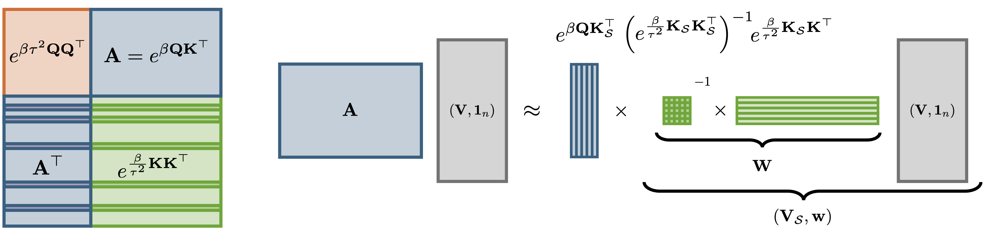

<p align="center">
  
</p>

<h1 align="center">WildCat</h1>

<p align="center">
  <strong>Near-Linear Attention in Theory and in Practice</strong><br/>
  Tobias Schröder &amp; Lester Mackey
</p>

<p align="center">
  <a href="https://arxiv.org/abs/2602.10056"></a>
  <a href="LICENSE"></a>
</p>

---

## Overview

WildCat (Weighted iterative low-rank decomposition for Coreset attention) is a drop-in attention module that guarantees approximate scaled dot-product attention in near-linear time. WildCat implements an online compression algorithm of the key-value sequence into a small weighted coreset from which the full attention mechanism is reconstructed. WildCat can be used to either accelerate non-causal attention calls directly at runtime, or to compress a pre-computed KV cache to near-constant cache sizes.

---

## Installation

WildCat was tested with Python < 3.13 and PyTorch. Install directly from GitHub:

```bash
pip install git+https://github.com/microsoft/wildcat.git
```

Or clone and install locally:

```bash
git clone https://github.com/microsoft/wildcat.git
cd wildcat
pip install -e .
```

The installation will also install `torch` as dependency.

---

## Usage

The WildCat module can be used as drop-in replacement for standard attention implementations at inference time. At the present time, training and causal masking is not natively supported. 

```python
import torch
from wildcat import WildCat

# Initialise module
attn = WildCat(
    r=128,           # coreset size (number of KV pairs to keep)
    num_bins=1,      # compression is distributed accross bins
    subsample_ratio=0.25,   # fallback compression ratio when r is not set
    compile = True    # use pre-compilation on GPU for additional performance gains
)

B, H, N, D = 2, 8, 4096, 64
queries = torch.randn(B, H, N, D)
keys    = torch.randn(B, H, N, D)
values  = torch.randn(B, H, N, D)

# Drop-in replacement for standard attention
output = attn(queries, keys, values)  # shape: (B, H, N, D)
```

The `compress_kv` function can also be used standalone to compress a KV cache:

```python
from wildcat import compress_kv

cmpd_keys, cmpd_values, weights = compress_kv(keys, values, r=128)
```

---

## Examples

All example experiment scripts live under `examples/`. Navigate into each subfolder and follow the setup instructions before running commands. We tested WildCat on image generation, image classification, and KV cache compression for long context language understanding tasks. 

#### BigGAN Image Generation

See [examples/biggan/README.md](examples/biggan/README.md) for setup and run instructions.

---

#### T2T-ViT ImageNet Classification

See [examples/t2t/README.md](examples/t2t/README.md) for setup and run instructions.

---

#### KV Cache Compression (LLMs)

See [examples/kvcache/README.md](examples/kvcache/README.md) for setup and run instructions.

---

## How It Works
The goal of WildCat is the approximation of the softmax (or scaled dot-product) attention mechanism
$$\text{Attn}(Q, K, V) = \text{softmax}\!\left(\beta Q  K^\top \right) V$$
for $Q, K, V\in \mathbb R^{n\times d}$ and scale parameter $\beta = \sqrt{d}^{-1}$. A direct implementation of the $\text{Attn}(Q, K, V)$ requires the evaluation of all $n^2$ entries of the attention matrix $A = \exp\left(\beta Q  K^\top\right)$, and therefore has quadratic time complexity in the sequence length $n$. WildCat finds a **low-rank decomposition** of the attention matrix $\widehat{A} = \exp\left(\beta Q  K_{\mathcal S}^\top\right) W$ with $W \in \mathbb R^{r\times n}$ and $K_{\mathcal S}$ a subset of rows of $K$. The factorisation enables the computation of approximate softmax attention in $O(nr)$ time:
$$
\widehat{\text{Attn}}(Q, K, V) = \frac{\exp\left(\beta Q  K_{\mathcal S}^\top \right) (W V)}{\exp\left(\beta Q  K_{\mathcal S}^\top\right) (W\boldsymbol 1_{n})}
$$

#### A Nyström based weighting scheme
The optimal weights $W$ are chosen to approximate the full attention matrix $\exp\left(\beta Q  K_{\mathcal S}^\top\right) W \approx A$. Solving the associated regression problem yields the Nyström weights
$
W = \exp\left(\tfrac{\beta}{\tau^2} K_{\mathcal S}K_{\mathcal S}^\top\right)^{-1}\exp\left(\tfrac{\beta}{\tau^2} K_{\mathcal S}K^\top\right)\,.
$
The parameter $\tau$ is a free parameter of the approximation for which we determine a near-optimal closed form expression. One of the major advantages of WildCat is that all keys and values participate in the compression, while no explicit access to the queries is required ahead of time.
<p align="center">
  
</p>

#### Coreset selection through randomly pivoted Cholesky
The coreset indices $\mathcal S\subseteq \{1, 2, \dots, n\}$ and the Nyström weights $W$ are determined in tandem through an adaptation of the [randomly pivoted Cholesky](https://arxiv.org/abs/2207.06503) algorithm. As a result, the compression is fast and numerically stable, requiring only $O(nr^2)$ operations and no explicit matrix inversion. In our [paper](https://arxiv.org/abs/2602.10056) we show that a near constant coreset size $r\in n^{o(1)}$ suffices to achieve error guarantees that decay super-polynomially, i.e. faster than $n^{-a}$ for any $a\in \mathbb N$. 

---


## License

This project is licensed under the [MIT License](LICENSE).
